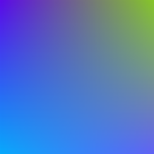

# Gradient Image Generator
  
This is a Python program that generates gradient images. It can be easily executed in Colab.   
## Features
① Specify image size  
② Random generation  
③ Batch generation  

